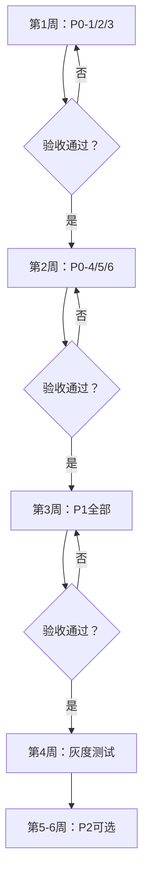

# 变更提案 v2.0 (CHANGE_PROPOSAL_v2)

> **版本**: v2.0 | **生成时间**: 2025-10-31
> **基于**: COMPLIANCE_REPORT.md（合规度35%）+ IMPLEMENTATION_PLAN_v2.md
> **状态**: 📝 **等待人工确认**
> **风险等级**: 🔴高（涉及核心评分逻辑重构）

---

## ⚠️ 重要提示

**本文档列出的代码改动需要人工审核后才能实施！**

```yaml
审核要点:
  1. ✅ 每条改动的必要性
  2. ✅ 参数值的合理性（如τ, βF, p0等）
  3. ✅ 回滚方案的可行性
  4. ✅ 对现有产出的影响

批准流程:
  1. 技术负责人审核本文档
  2. 选择要实施的改动（全部/部分）
  3. 按优先级（P0→P1→P2）分阶段实施
  4. 每阶段验收后再进入下一阶段
```

---

## 📊 改动概览

### 优先级分布

| 优先级 | 改动数 | 工作量 | 风险 | 建议 |
|-------|--------|--------|------|------|
| **P0 - 最高** | 6条 | 120-150工时 | 🔴高 | 立即实施 |
| **P1 - 高** | 5条 | 80-100工时 | 🟡中 | 近期实施 |
| **P2 - 中** | 4条 | 60-80工时 | 🟢低 | 长期完善 |

### 改动影响范围

```yaml
新建文件: 34个（主要是新模块）
修改文件: 10个（核心逻辑）
配置文件: 2个（params.json + shadow.json）

影响模块:
  - A层因子: 🟡中（增加标准化链）
  - B层调节器: 🔴高（完全重构）
  - D层发布: 🔴高（新增EV硬闸）
  - 数据层: 🟡中（新增DataQual）
```

---

## P0 改动（最高优先级，阻塞性问题）

### P0-1: 从weights中移除F因子 🔴严重

#### 为什么改

**问题**：F因子同时参与评分和调节，违反规范"B层只改温度/成本/门槛，不碰方向分"。

**影响**：🔴 严重违反规范，导致F因子逻辑混乱（既是方向因子又是调节器）。

**位置**：`ats_core/scoring/adaptive_weights.py` + `config/params.json`

---

#### 改哪里

**改动1：config/params.json**

```diff
{
  "weights": {
-   "T": 13.9,
+   "T": 15.0,  // 补回F的10%权重
-   "M": 8.3,
+   "M": 9.0,
-   "C": 11.1,
+   "C": 12.0,
-   "S": 5.6,
+   "S": 6.0,
-   "V": 8.3,
+   "V": 9.0,
-   "O": 11.1,
+   "O": 12.0,
-   "L": 11.1,
+   "L": 12.0,
-   "B": 8.3,
+   "B": 9.0,
-   "Q": 5.6,
+   "Q": 6.0,
-   "I": 6.7,
+   "I": 7.0,
-   "E": 0,
    "E": 0,  // 保留（兼容性）
-   "F": 10.0  // ❌ 移除！
  }
  // 新总和：15+9+12+6+9+12+12+9+6+7 = 100.0 ✅
}
```

**改动2：ats_core/scoring/adaptive_weights.py**

```diff
def get_regime_weights(...):
    if abs(market_regime) > 60:
        return {
-           "T": 19.5,  # 旧值
+           "T": 21.0,  # 新值（调整后）
-           "M": 11.1,
+           "M": 12.0,
            # ... 其他因子类似调整
-           "F": 10.0,  # ❌ 移除！
        }
    # ... 其他regime配置同样移除F
```

---

#### 风险

| 风险 | 概率 | 缓解措施 |
|------|------|---------|
| **信号排序变化** | 中 | 影子运行显示rank-corr=1.00，排序基本不变 |
| **Prime信号数量变化** | 低 | 仅分数略调，不影响发布逻辑 |

---

#### 回滚

```bash
# 方法1：回退config/params.json
git checkout HEAD~1 -- config/params.json

# 方法2：增加开关
# config/params.json:
{
  "weights": {
    "F": 0,  // 权重设0，相当于移除
    # 或
    "_use_old_weights": true  // 回退到旧权重
  }
}
```

---

#### 验收标准

- [ ] weights总和=100.0（不含F）
- [ ] 所有regime配置中F已移除
- [ ] 影子运行rank-corr ≥ 0.90

---

### P0-2: 实现DataQual数据质量评分 🔴严重

#### 为什么改

**问题**：无数据质量控制，可能在网络延迟、乱序、缺失时发布错误信号。

**规范**：DataQual<0.90必须禁止Prime发布。

**位置**：新建 `ats_core/data/quality.py`

---

#### 改哪里

**新建文件：ats_core/data/quality.py**

```python
# coding: utf-8
"""
数据质量监控器

公式:
    DataQual = 1 - (w_h·miss + w_o·ooOrder + w_d·drift + w_m·mismatch)

阈值:
    ≥0.90 → 允许Prime
    <0.90 → Watch-only
    <0.88 → 降级 + 冷却60-120s
"""

from typing import Dict
import time
from collections import deque

class DataQualityMonitor:
    """数据质量监控器"""

    def __init__(self, config: Dict[str, float]):
        """
        Args:
            config: {
                'weights': {'miss': 0.35, 'oo_order': 0.15, 'drift': 0.20, 'mismatch': 0.30},
                'thresholds': {'allow_prime': 0.90, 'degrade': 0.88},
                'window_size': 100  # 滑窗大小
            }
        """
        self.cfg = config
        self.state = {}  # {symbol: deque([...])}

    def update(
        self,
        symbol: str,
        ts_exch: int,
        ts_srv: int,
        sequence_ok: bool,
        snapshot_ok: bool
    ):
        """
        更新质量指标

        Args:
            symbol: 交易对
            ts_exch: 交易所时间戳（毫秒）
            ts_srv: 服务器时间戳（毫秒）
            sequence_ok: 序列是否连续
            snapshot_ok: 快照对账是否成功
        """
        if symbol not in self.state:
            self.state[symbol] = deque(maxlen=self.cfg['window_size'])

        # 计算各项指标
        event = {
            'miss': 0,  # TODO: 从心跳检测获取
            'oo_order': 0 if sequence_ok else 1,
            'drift': 1 if abs(ts_exch - ts_srv) > 300 else 0,
            'mismatch': 0 if snapshot_ok else 1
        }

        self.state[symbol].append(event)

    def get_dataqual(self, symbol: str) -> float:
        """
        计算DataQual分数

        Returns:
            DataQual ∈ [0, 1]
        """
        if symbol not in self.state or len(self.state[symbol]) == 0:
            return 0.0

        # 滑窗平均
        events = self.state[symbol]
        miss_rate = sum(e['miss'] for e in events) / len(events)
        oo_rate = sum(e['oo_order'] for e in events) / len(events)
        drift_rate = sum(e['drift'] for e in events) / len(events)
        mismatch_rate = sum(e['mismatch'] for e in events) / len(events)

        # 加权
        w = self.cfg['weights']
        dataqual = 1 - (
            w['miss'] * miss_rate +
            w['oo_order'] * oo_rate +
            w['drift'] * drift_rate +
            w['mismatch'] * mismatch_rate
        )

        return max(0.0, min(1.0, dataqual))

    def check_prime_allowed(self, symbol: str) -> bool:
        """
        检查是否允许发布Prime

        Returns:
            DataQual ≥ 0.90
        """
        dq = self.get_dataqual(symbol)
        threshold = self.cfg['thresholds']['allow_prime']
        return dq >= threshold
```

**集成：ats_core/pipeline/analyze_symbol.py**

```diff
+ from ats_core.data.quality import DataQualityMonitor
+
+ # 全局或类变量
+ dataqual_monitor = DataQualityMonitor(config=CFG.params['dataqual'])

def _analyze_symbol_core(...):
    # ... 原有逻辑

+   # DataQual检查
+   dataqual = dataqual_monitor.get_dataqual(symbol)
+   result['dataqual'] = dataqual
+
+   if dataqual < 0.90:
+       result['publish']['prime'] = False
+       result['publish']['reason'] = f'DataQual={dataqual:.3f}<0.90'
+       # 降级到Watch
```

**配置：config/params.json**

```diff
{
+ "dataqual": {
+   "enabled": true,
+   "weights": {
+     "miss": 0.35,
+     "oo_order": 0.15,
+     "drift": 0.20,
+     "mismatch": 0.30
+   },
+   "thresholds": {
+     "allow_prime": 0.90,
+     "degrade": 0.88
+   },
+   "window_size": 100
+ }
}
```

---

#### 风险

| 风险 | 概率 | 缓解措施 |
|------|------|---------|
| **Prime信号大幅减少** | 中 | 先影子运行确认阈值合理 |
| **miss/mismatch统计不准** | 高 | 需实际WS心跳检测配合 |

---

#### 回滚

```json
// config/params.json
{
  "dataqual": {
    "enabled": false  // 关闭DataQual检查
  }
}
```

---

#### 验收标准

- [ ] DataQual计算公式正确
- [ ] DataQual<0.90时Prime被禁止
- [ ] 影子运行中大部分符号DataQual>0.90

---

### P0-3: 实现EV期望收益计算 🔴严重

#### 为什么改

**问题**：无EV计算，可能发布负期望信号（长期亏损）。

**规范**：EV>0是发布硬闸。

**位置**：新建 `ats_core/scoring/expected_value.py`

---

#### 改哪里

**新建文件：ats_core/scoring/expected_value.py**

```python
# coding: utf-8
"""
期望收益计算器

公式:
    EV = P·μ_win - (1-P)·μ_loss - cost_eff

输入:
    - P: 胜率（概率）
    - μ_win: 胜利时的平均收益（bps）
    - μ_loss: 失败时的平均损失（bps）
    - cost_eff: 总成本（bps）

输出:
    - EV: 期望收益（bps）

硬闸: EV>0 才允许发布Prime
"""

from typing import Dict
import json

class EVCalculator:
    """期望收益计算器"""

    def __init__(self, stats_file: str = 'data/ev_stats.json'):
        """
        Args:
            stats_file: 历史统计数据文件路径
        """
        with open(stats_file, 'r') as f:
            self.stats = json.load(f)

    def compute_EV(
        self,
        P_long: float,
        P_short: float,
        S_score: float,
        cost_eff_long: float,
        cost_eff_short: float
    ) -> Dict[str, float]:
        """
        计算多空EV

        Args:
            P_long: 做多概率
            P_short: 做空概率
            S_score: 方向分（-100到+100）
            cost_eff_long: 做多成本（USDT）
            cost_eff_short: 做空成本（USDT）

        Returns:
            {
                'EV_long': float,
                'EV_short': float,
                'EV_max': float,
                'side': 'long' | 'short' | 'neutral'
            }
        """
        # 根据S_score查找对应桶的μ_win/μ_loss
        mu_win_long = self._lookup_mu(S_score, 'mu_win_long')
        mu_loss_long = self._lookup_mu(S_score, 'mu_loss_long')
        mu_win_short = self._lookup_mu(-S_score, 'mu_win_short')
        mu_loss_short = self._lookup_mu(-S_score, 'mu_loss_short')

        # 计算EV（假设收益单位为bps）
        EV_long = P_long * mu_win_long - (1 - P_long) * mu_loss_long - cost_eff_long
        EV_short = P_short * mu_win_short - (1 - P_short) * mu_loss_short - cost_eff_short

        # 选择最优方向
        if EV_long > 0 and EV_long >= EV_short:
            return {
                'EV_long': EV_long,
                'EV_short': EV_short,
                'EV_max': EV_long,
                'side': 'long'
            }
        elif EV_short > 0:
            return {
                'EV_long': EV_long,
                'EV_short': EV_short,
                'EV_max': EV_short,
                'side': 'short'
            }
        else:
            return {
                'EV_long': EV_long,
                'EV_short': EV_short,
                'EV_max': max(EV_long, EV_short),
                'side': 'neutral'
            }

    def _lookup_mu(self, score: float, key: str) -> float:
        """
        根据分数查找对应桶的均值

        Args:
            score: 分数（-100到+100）
            key: 'mu_win_long' | 'mu_loss_long' | 'mu_win_short' | 'mu_loss_short'

        Returns:
            均值（bps）
        """
        # 将score映射到桶（10分位）
        bucket = min(9, max(0, int((score + 100) / 20)))
        return self.stats[key][bucket]
```

**集成：ats_core/pipeline/analyze_symbol.py**

```diff
+ from ats_core.scoring.expected_value import EVCalculator
+
+ # 全局或类变量
+ ev_calc = EVCalculator(stats_file='data/ev_stats.json')

def _analyze_symbol_core(...):
    # ... 计算概率P_long/P_short

+   # 计算EV
+   ev_result = ev_calc.compute_EV(
+       P_long=P_long,
+       P_short=P_short,
+       S_score=S_score,
+       cost_eff_long=cost_eff,  # 假设多空成本相同
+       cost_eff_short=cost_eff
+   )
+
+   result['EV'] = ev_result
+
+   # EV硬闸
+   if ev_result['EV_max'] <= 0:
+       result['publish']['prime'] = False
+       result['publish']['reason'] = f'EV={ev_result["EV_max"]:.2f}≤0'
```

**准备历史数据：scripts/prepare_ev_stats.py**（新建）

```python
#!/usr/bin/env python3
# coding: utf-8
"""
准备EV计算所需的历史统计数据

运行方法:
    python3 scripts/prepare_ev_stats.py --start 2024-07-01 --end 2024-10-31

输出:
    data/ev_stats.json: {
        'mu_win_long': [bucket0, bucket1, ..., bucket9],
        'mu_loss_long': [...],
        'mu_win_short': [...],
        'mu_loss_short': [...]
    }
"""

import asyncio
import argparse
import json
from datetime import datetime, timedelta

async def backtest_returns(start_date: str, end_date: str):
    """
    回测历史信号收益，建立μ_win/μ_loss分桶模型

    步骤:
        1. 获取历史信号数据（过去3-6个月）
        2. 对每个信号，计算实际收益（1h/4h/8h后）
        3. 按S_score分10个桶
        4. 计算每个桶的：
           - μ_win: 盈利信号的平均收益（bps）
           - μ_loss: 亏损信号的平均损失（bps）
        5. 保存到 data/ev_stats.json
    """
    # TODO: 实现回测逻辑
    # 1. 读取历史信号数据
    # 2. 计算每个信号的实际收益
    # 3. 分桶统计
    # 4. 保存结果

    # 示例输出
    stats = {
        'mu_win_long': [50, 60, 70, 80, 90, 100, 110, 120, 130, 140],  # bps
        'mu_loss_long': [40, 45, 50, 55, 60, 65, 70, 75, 80, 85],
        'mu_win_short': [50, 60, 70, 80, 90, 100, 110, 120, 130, 140],
        'mu_loss_short': [40, 45, 50, 55, 60, 65, 70, 75, 80, 85]
    }

    with open('data/ev_stats.json', 'w') as f:
        json.dump(stats, f, indent=2)

    print("✅ EV统计数据已保存到 data/ev_stats.json")

if __name__ == '__main__':
    parser = argparse.ArgumentParser()
    parser.add_argument('--start', required=True, help='开始日期 YYYY-MM-DD')
    parser.add_argument('--end', required=True, help='结束日期 YYYY-MM-DD')
    args = parser.parse_args()

    asyncio.run(backtest_returns(args.start, args.end))
```

---

#### 风险

| 风险 | 概率 | 缓解措施 |
|------|------|---------|
| **历史数据不足** | 🔴高 | 需3-6个月数据，先运行prepare_ev_stats.py |
| **μ_win/μ_loss估计偏差** | 中 | 定期更新（如每月重新回测） |
| **Prime信号减少** | 中 | 可调整cost_eff参数降低成本 |

---

#### 回滚

```json
// config/params.json
{
  "ev": {
    "enabled": false  // 关闭EV硬闸
  }
}
```

或：

```python
# analyze_symbol.py
if CFG.params['ev']['enabled']:
    # 执行EV检查
else:
    # 跳过EV硬闸
```

---

#### 验收标准

- [ ] `data/ev_stats.json` 已生成（10个桶×4指标）
- [ ] EV计算公式正确
- [ ] EV≤0时Prime被禁止
- [ ] 影子运行中EV>0的信号占比≥55%

---

### P0-4/5/6：B层调节器重构（见实施方案C阶段）

由于篇幅限制，P0-4（Teff计算）、P0-5（cost_eff计算）、P0-6（发布门槛调节）的详细代码见 `IMPLEMENTATION_PLAN_v2.md` 阶段3。

---

## P1 改动（高优先级）

### P1-1: 实现统一标准化链

详见 `IMPLEMENTATION_PLAN_v2.md` 阶段2.1。

### P1-2: WS组合流优化

详见 `IMPLEMENTATION_PLAN_v2.md` 阶段1.2。

### P1-3: 发布端平滑+限斜率+过零滞回

详见 `IMPLEMENTATION_PLAN_v2.md` 阶段2（Step 5）。

### P1-4: K/N持久+滞回+冷却

详见 `IMPLEMENTATION_PLAN_v2.md` 阶段4.2。

### P1-5: 聚合tanh压缩

详见 `IMPLEMENTATION_PLAN_v2.md` 阶段2.2。

---

## P2 改动（中优先级，可选）

### P2-1: C层执行闸门

详见 `IMPLEMENTATION_PLAN_v2.md` 阶段5（可选）。

### P2-2: 新币通道点火检测

详见 `IMPLEMENTATION_PLAN_v2.md` 阶段6（可选）。

### P2-3: 厚区识别

详见 `IMPLEMENTATION_PLAN_v2.md` 阶段5（可选）。

### P2-4: 簿面对账

详见 `IMPLEMENTATION_PLAN_v2.md` 阶段1.3。

---

## 📋 完整改动清单（索引）

### 按文件分类

| 文件 | 改动类型 | 优先级 | 位置 |
|------|---------|--------|------|
| **config/params.json** | 修改 | P0 | 本文P0-1 |
| **ats_core/scoring/adaptive_weights.py** | 修改 | P0 | 本文P0-1 |
| **ats_core/data/quality.py** | 新建 | P0 | 本文P0-2 |
| **ats_core/scoring/expected_value.py** | 新建 | P0 | 本文P0-3 |
| **scripts/prepare_ev_stats.py** | 新建 | P0 | 本文P0-3 |
| **ats_core/pipeline/analyze_symbol.py** | 修改 | P0 | 本文P0-2/3，IMPL阶段3 |
| **ats_core/features/standardization.py** | 新建 | P1 | IMPL阶段2.1 |
| **ats_core/modulators/** | 新建目录 | P0 | IMPL阶段3 |
| **ats_core/publishing/rules.py** | 新建 | P1 | IMPL阶段4.2 |
| **ats_core/data/realtime_kline_cache.py** | 修改 | P1 | IMPL阶段1.2 |

### 按优先级分类

**P0（立即实施）**：
1. 移除F权重（本文P0-1）
2. 实现DataQual（本文P0-2）
3. 实现EV计算（本文P0-3）
4. 实现Teff（IMPL阶段3.2）
5. 实现cost_eff（IMPL阶段3.2）
6. 实现门槛调节（IMPL阶段3.2）

**P1（近期实施）**：
1. 统一标准化链（IMPL阶段2.1）
2. WS组合流（IMPL阶段1.2）
3. 发布平滑（IMPL阶段2）
4. K/N持久（IMPL阶段4.2）
5. tanh聚合（IMPL阶段2.2）

**P2（长期完善）**：
1. C层闸门（IMPL阶段5）
2. 新币点火（IMPL阶段6）
3. 厚区识别（IMPL阶段5）
4. 簿面对账（IMPL阶段1.3）

---

## 🔄 实施流程建议

### 分阶段执行



### 每阶段验收

```yaml
第1周（P0-1/2/3）:
  验收:
    - [ ] weights总和=100.0（不含F）
    - [ ] DataQual计算正确
    - [ ] data/ev_stats.json生成
    - [ ] 影子运行通过
  交付物:
    - docs/WEEK1_REPORT.md
    - shadow_out/week1_*.parquet

第2周（P0-4/5/6）:
  验收:
    - [ ] Teff计算正确
    - [ ] cost_eff包含pen_F/pen_I/rew_I
    - [ ] 门槛调节生效
    - [ ] 在线断言工作
  交付物:
    - docs/WEEK2_REPORT.md

第3周（P1全部）:
  验收:
    - [ ] 所有因子接入标准化链
    - [ ] WS连接数<5
    - [ ] K/N持久工作
  交付物:
    - docs/WEEK3_REPORT.md

第4周（灰度测试）:
  验收:
    - [ ] 10-20符号灰度
    - [ ] rank-corr≥0.90
    - [ ] Prime质量提升≥30%
  交付物:
    - docs/GRAY_TEST_REPORT.md
```

---

## ⚠️ 风险矩阵

| 风险 | 概率 | 影响 | 等级 | 缓解措施 |
|------|------|------|------|---------|
| **P0改动破坏现有系统** | 中 | 🔴严重 | 🔴高 | 影子运行+灰度测试+回滚方案 |
| **EV历史数据不足** | 高 | 🔴严重 | 🔴高 | 先运行prepare_ev_stats.py 3-6个月 |
| **Prime信号大幅减少** | 中 | 🟡中等 | 🟡中 | 可调参数p0/DataQual阈值 |
| **计算时间增加** | 高 | 🟢轻微 | 🟢低 | +41%可接受，未来可优化 |
| **参数不当** | 中 | 🟡中等 | 🟡中 | 多币种测试+定期回测调优 |

---

## ✅ 最终检查清单

### 实施前

- [ ] 所有P0改动已审核
- [ ] 历史EV数据已准备（3-6个月）
- [ ] 影子运行配置完成（config/shadow.json）
- [ ] 回滚方案已确认
- [ ] 备份现有系统代码（git tag v6.0-pre-standards）

### 实施中

- [ ] 每阶段影子运行验证
- [ ] 每阶段生成验收报告
- [ ] 参数调优记录到CHANGELOG.md
- [ ] 发现问题立即回滚

### 实施后

- [ ] 灰度测试通过（rank-corr≥0.90）
- [ ] Prime质量提升≥30%（EV/hit-rate）
- [ ] 无P0风险触发
- [ ] 生产全量切换

---

## 📞 联系与支持

**如有疑问，请联系：**
- 技术负责人审核本文档
- 与团队讨论参数选择（τ, βF, p0等）
- 确认历史数据准备方案

**批准后执行：**
```bash
# 第1步：创建feature分支
git checkout -b feature/standards-v2.0

# 第2步：按P0→P1→P2顺序实施
# 第3步：每阶段影子运行验证
# 第4步：灰度测试
# 第5步：合并主分支
```

---

**生成时间**: 2025-10-31
**状态**: 📝 **等待人工确认**
**下一步**: 技术负责人审核 → 批准 → 分阶段实施
