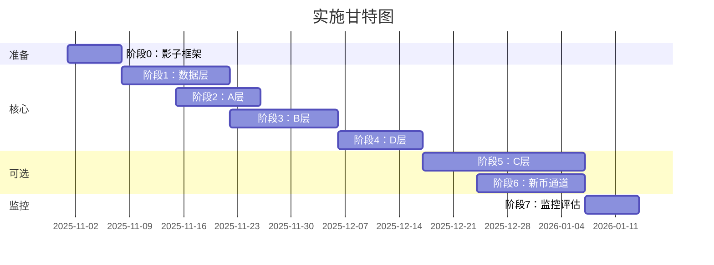

# 实施方案 v2.0 (IMPLEMENTATION_PLAN_v2)

> **版本**: v2.0 | **生成时间**: 2025-10-31
> **基于**: COMPLIANCE_REPORT.md（合规度35%）
> **目标**: 分阶段实施新规范，影子运行→灰度→全量
> **原则**: 可灰度、可回退、不影响现有产出

---

## 📋 执行摘要

### 总体策略

```
阶段0：准备工作（影子框架搭建）→ 1周
阶段1：数据层（DataQual + WS优化）→ 2周
阶段2：A层（统一标准化链）→ 1.5周
阶段3：B层（调节器F/I重构）→ 2周
阶段4：D层（EV计算 + 发布规则）→ 1.5周
阶段5：C层（执行闸门，可选）→ 3周
阶段6：新币通道（点火检测，可选）→ 2周
阶段7：监控与评估（漂移监测）→ 1周

总计：14周（核心6周，可选+监控8周）
```

### 并行策略



---

## 阶段0：准备工作 - 影子框架搭建（1周）

### 目标

- 不触碰现有业务逻辑
- 搭建独立的影子运行框架
- 可随时开关，不影响生产

### 改动清单

#### 新建文件

| 文件路径 | 作用 | 大小估算 |
|---------|------|---------|
| `scripts/shadow_runner.py` | 影子运行入口 | 200行 |
| `ats_core/shadow/` | 影子模块目录 | - |
| `ats_core/shadow/__init__.py` | 包初始化 | 10行 |
| `ats_core/shadow/config.py` | 影子配置管理 | 80行 |
| `ats_core/shadow/storage.py` | 结果存储（Parquet/JSON） | 150行 |
| `shadow_out/` | 输出目录（git ignore） | - |
| `config/shadow.json` | 影子配置文件 | - |

#### 配置示例

**`config/shadow.json`**：
```json
{
  "enabled": true,
  "mode": "shadow",  // shadow | gray | full
  "symbols": ["BTCUSDT", "ETHUSDT", "BNBUSDT"],  // 初始测试
  "outputs": {
    "features_a": "shadow_out/features_a_{timestamp}.parquet",
    "features_b": "shadow_out/features_b_modulators.parquet",
    "decision_events": "shadow_out/decision_events.jsonl"
  },
  "logging": {
    "level": "INFO",
    "file": "shadow_out/shadow_run.log"
  }
}
```

#### 接口定义

**`scripts/shadow_runner.py`**：
```python
async def run_shadow(
    symbols: List[str],
    config: Dict[str, Any]
) -> Dict[str, Any]:
    """
    影子运行主函数

    Args:
        symbols: 测试币种列表
        config: 影子配置

    Returns:
        {
            'summary': {...},
            'outputs': {
                'features_a': 'path/to/file',
                'features_b': 'path/to/file',
                'decision_events': 'path/to/file'
            }
        }
    """
    pass
```

### 回滚策略

```bash
# 完全回滚：删除影子目录
rm -rf ats_core/shadow/ shadow_out/ scripts/shadow_runner.py config/shadow.json

# 部分回滚：关闭影子开关
echo '{"enabled": false}' > config/shadow.json
```

### 验收标准

- ✅ `shadow_runner.py` 可独立运行，不报错
- ✅ 输出文件正确生成到 `shadow_out/`
- ✅ 不影响 `scripts/realtime_signal_scanner.py` 运行

---

## 阶段1：数据层 - DataQual + WS优化（2周）

### 1.1 DataQual 数据质量评分（P0）

#### 改动文件

**新建**：`ats_core/data/quality.py`

```python
class DataQualityMonitor:
    """数据质量监控器"""

    def __init__(self, weights: Dict[str, float]):
        """
        Args:
            weights: {
                'miss': 0.35,
                'oo_order': 0.15,
                'drift': 0.20,
                'mismatch': 0.30
            }
        """
        self.weights = weights
        self.state = {}  # {symbol: {miss, ooOrder, drift, mismatch}}

    def update(
        self,
        symbol: str,
        ts_exch: int,
        ts_srv: int,
        sequence_ok: bool,
        snapshot_ok: bool
    ):
        """
        更新质量指标

        Args:
            symbol: 交易对
            ts_exch: 交易所时间戳
            ts_srv: 服务器时间戳
            sequence_ok: 序列是否连续
            snapshot_ok: 快照对账是否成功
        """
        pass

    def get_dataqual(self, symbol: str) -> float:
        """
        计算DataQual分数

        Returns:
            DataQual = 1 - (w_h·miss + w_o·ooOrder + w_d·drift + w_m·mismatch)
            范围：[0, 1]
        """
        pass

    def check_prime_allowed(self, symbol: str) -> bool:
        """
        检查是否允许发布Prime

        Returns:
            DataQual >= 0.90
        """
        dq = self.get_dataqual(symbol)
        return dq >= 0.90
```

#### 接口输入

```yaml
输入:
  - ts_exch: int (交易所时间戳，毫秒)
  - ts_srv: int (服务器时间戳，毫秒)
  - sequence_ok: bool (序列连续性)
  - snapshot_ok: bool (快照对账成功)

输出:
  - DataQual: float [0, 1]
  - allow_prime: bool
  - components: {miss, ooOrder, drift, mismatch}
```

#### 参数来源

- **权重**：SPEC_DIGEST.json → `data_layer.dataqual_formula.weights`
  ```json
  {
    "w_h": 0.35,
    "w_o": 0.15,
    "w_d": 0.20,
    "w_m": 0.30
  }
  ```

- **阈值**：SPEC_DIGEST.json → `data_layer.dataqual_formula.thresholds`
  ```json
  {
    "allow_prime": 0.90,
    "degrade": 0.88
  }
  ```

#### 集成点

**修改**：`ats_core/pipeline/analyze_symbol.py`

```python
# 在analyze_symbol()函数开头添加
from ats_core.data.quality import DataQualityMonitor

dataqual_monitor = DataQualityMonitor(weights=CFG.params['dataqual']['weights'])

# 在返回前检查
dataqual = dataqual_monitor.get_dataqual(symbol)
if dataqual < 0.90:
    result['publish']['prime'] = False  # 降级为Watch
    result['publish']['reason'] = 'DataQual<0.90'
```

#### 回滚策略

```python
# config/params.json 添加开关
{
  "dataqual": {
    "enabled": false,  // 关闭DataQual检查
    "weights": {...}
  }
}

# 代码中
if CFG.params['dataqual']['enabled']:
    # 执行DataQual检查
else:
    # 跳过
```

---

### 1.2 WS组合流优化（P1）

#### 改动文件

**修改**：`ats_core/data/realtime_kline_cache.py`

**核心改动**：
```python
# 当前：每个symbol×interval独立订阅
# @kline_1h:BTCUSDT
# @kline_1h:ETHUSDT
# ...（100+ 连接）

# 改为：组合流
# @kline_1h:BTCUSDT/ETHUSDT/BNBUSDT/...
# 单个连接可订阅多个symbol
```

**新增方法**：
```python
def subscribe_multiplex_stream(
    self,
    symbols: List[str],
    interval: str,
    max_per_stream: int = 50  # 单个流最多50个symbol
) -> List[str]:
    """
    订阅组合流

    Args:
        symbols: 币种列表
        interval: K线周期
        max_per_stream: 单个流的最大symbol数

    Returns:
        stream_ids: 组合流ID列表
    """
    # 分组：每50个symbol一个组
    groups = [symbols[i:i+max_per_stream] for i in range(0, len(symbols), max_per_stream)]

    stream_ids = []
    for group in groups:
        stream_name = f"kline_{interval}:" + "/".join(group)
        # 订阅组合流
        stream_ids.append(stream_name)

    return stream_ids
```

#### 预期效果

```yaml
优化前:
  - 200币种 × 3周期 = 600个连接
  - 内存占用：~500MB
  - 重连风暴：高

优化后:
  - 200币种 ÷ 50 = 4组 × 3周期 = 12个连接（减少98%）
  - 内存占用：~200MB
  - 重连稳定性：高
```

#### 回滚策略

```python
# config/params.json
{
  "ws": {
    "use_multiplex": false,  // false=使用旧模式
    "max_per_stream": 50
  }
}
```

---

### 1.3 双时戳 + 乱序修复

#### 改动文件

**新建**：`ats_core/data/event_buffer.py`

```python
class EventBuffer:
    """带时序修复的事件缓冲器"""

    def __init__(self, reorder_window_ms: int = 2000):
        self.reorder_window_ms = reorder_window_ms
        self.buffer = []  # [(ts_exch, data)]

    def add(self, ts_exch: int, ts_srv: int, data: Any):
        """
        添加事件，自动按ts_exch排序

        Args:
            ts_exch: 交易所时间戳
            ts_srv: 服务器时间戳
            data: 事件数据
        """
        self.buffer.append((ts_exch, ts_srv, data))
        # 限时重排
        now = max(ts for ts, _, _ in self.buffer)
        cutoff = now - self.reorder_window_ms

        # 超过窗口的事件固化
        fixed = [e for e in self.buffer if e[0] <= cutoff]
        fixed.sort(key=lambda e: e[0])  # 按ts_exch排序

        self.buffer = [e for e in self.buffer if e[0] > cutoff]

        return fixed
```

---

## 阶段2：A层 - 统一标准化链（1.5周）

### 2.1 标准化链实现（P1）

#### 新建文件

**`ats_core/features/standardization.py`**：

```python
import numpy as np
from collections import deque
from typing import List, Tuple

class RobustStandardizer:
    """统一稳健标准化链"""

    def __init__(self, config: Dict[str, Any]):
        """
        Args:
            config: {
                'alpha_smooth': 0.3,  # 预平滑系数
                'eta': 0.05,  # EW-Median/MAD更新率
                'z0': 2.5,  # winsor阈值
                'zmax': 6,  # winsor上限
                'lambda_winsor': 1.5,  # winsor平滑系数
                'tau': 2.2,  # tanh温度
                'alpha_pub': 0.30,  # 发布平滑
                'delta_max': 15,  # 限斜率
                'zero_cross_hysteresis': 10  # 过零滞回
            }
        """
        self.cfg = config
        self.state = {}  # {symbol: {x_smooth, median, mad, s_pub}}

    def transform(
        self,
        symbol: str,
        x_raw: float
    ) -> Tuple[float, Dict[str, float]]:
        """
        执行完整标准化链

        Returns:
            (s_k, meta)
            s_k: ±100标准化分数
            meta: {x_smooth, z, z_soft, s_raw, s_pub}
        """
        # Step 1: 预平滑
        x_smooth = self._smooth(symbol, x_raw)

        # Step 2: 稳健缩放（EW-Median/MAD）
        z = self._robust_scale(symbol, x_smooth)

        # Step 3: 软winsor
        z_soft = self._soft_winsor(z)

        # Step 4: tanh压缩
        s_raw = 100 * np.tanh(z_soft / self.cfg['tau'])

        # Step 5: 发布平滑 + 限斜率 + 过零滞回
        s_pub = self._publish_smooth(symbol, s_raw)

        return s_pub, {
            'x_smooth': x_smooth,
            'z': z,
            'z_soft': z_soft,
            's_raw': s_raw,
            's_pub': s_pub
        }

    def _smooth(self, symbol: str, x: float) -> float:
        """Step 1: 预平滑"""
        alpha = self.cfg['alpha_smooth']
        if symbol not in self.state:
            self.state[symbol] = {'x_smooth': x}
            return x

        x_prev = self.state[symbol]['x_smooth']
        x_smooth = alpha * x + (1 - alpha) * x_prev
        self.state[symbol]['x_smooth'] = x_smooth
        return x_smooth

    def _robust_scale(self, symbol: str, x: float) -> float:
        """Step 2: 稳健缩放（EW-Median/MAD）"""
        # EW-Median/MAD实现
        # TODO: 使用滑动中位数 + MAD估计
        pass

    def _soft_winsor(self, z: float) -> float:
        """Step 3: 软winsor（连续无台阶）"""
        z0 = self.cfg['z0']
        zmax = self.cfg['zmax']
        lam = self.cfg['lambda_winsor']

        if abs(z) <= z0:
            return z
        else:
            sign = 1 if z > 0 else -1
            return sign * (z0 + (zmax - z0) * (1 - np.exp(-(abs(z) - z0) / lam)))

    def _publish_smooth(self, symbol: str, s_raw: float) -> float:
        """Step 5: 发布平滑 + 限斜率 + 过零滞回"""
        if symbol not in self.state or 's_pub' not in self.state[symbol]:
            self.state[symbol]['s_pub'] = s_raw
            return s_raw

        s_prev = self.state[symbol]['s_pub']
        alpha_s = self.cfg['alpha_pub']
        delta_max = self.cfg['delta_max']
        hysteresis = self.cfg['zero_cross_hysteresis']

        # 平滑
        s_smooth = (1 - alpha_s) * s_prev + alpha_s * s_raw

        # 限斜率
        delta = s_smooth - s_prev
        if abs(delta) > delta_max:
            delta = np.sign(delta) * delta_max
            s_smooth = s_prev + delta

        # 过零滞回
        if s_prev * s_smooth < 0 and abs(s_smooth) < hysteresis:
            s_smooth = s_prev  # 不允许翻符号

        self.state[symbol]['s_pub'] = s_smooth
        return s_smooth
```

#### 集成点

**修改各因子文件**：

```python
# ats_core/features/trend.py

from ats_core.features.standardization import RobustStandardizer

# 全局或类变量
_standardizer = RobustStandardizer(config=CFG.params['standardization']['T'])

def score_trend(...) -> Tuple[int, int]:
    # 原有逻辑计算T_raw
    T_raw = ...

    # 标准化
    T_normalized, meta = _standardizer.transform(symbol, T_raw)

    return int(T_normalized), meta
```

#### 参数来源

**`config/params.json`**：
```json
{
  "standardization": {
    "T": {"alpha_smooth": 0.3, "tau": 2.2, ...},
    "M": {"alpha_smooth": 0.3, "tau": 2.4, ...},
    "C": {"alpha_smooth": 0.3, "tau": 2.2, ...},
    "...": {}
  }
}
```

#### 回滚策略

```json
// config/params.json
{
  "standardization": {
    "enabled": false  // 回退到原始逻辑
  }
}
```

---

### 2.2 聚合tanh压缩

#### 修改文件

**`ats_core/scoring/scorecard.py:46`**

```python
# 现有（硬clip）
weighted_score = max(-100.0, min(100.0, weighted_score))

# 改为tanh
T_agg = CFG.params.get('aggregation', {}).get('T_agg', 100.0)
weighted_score = 100.0 * np.tanh(weighted_score / T_agg)
```

#### 参数

```json
// config/params.json
{
  "aggregation": {
    "T_agg": 100.0,  // tanh温度
    "use_tanh": true  // 开关
  }
}
```

---

## 阶段3：B层 - 调节器F/I重构（2周）⚠️最复杂

### 3.1 核心改动：从weights中移除F

#### 修改文件

**`config/params.json`**：
```json
{
  "weights": {
    // 移除 "F": 10.0
    "T": 15.0,  // 原13.9，补回F的10%
    "M": 9.0,   // 原8.3
    "C": 12.0,  // 原11.1
    "S": 6.0,   // 原5.6
    "V": 9.0,   // 原8.3
    "O": 12.0,  // 原11.1
    "L": 12.0,  // 原11.1
    "B": 9.0,   // 原8.3
    "Q": 6.0,   // 原5.6
    "I": 7.0    // 原6.7
    // 总计：100.0（不含F）
  }
}
```

**`ats_core/scoring/adaptive_weights.py`**：
```python
# 所有regime权重配置中移除F
def get_regime_weights(...):
    if abs(market_regime) > 60:
        return {
            "T": 21.0,  // 调整后
            "M": 12.0,
            # ... 不含F
        }
```

---

### 3.2 新建B层模块

#### 目录结构

```
ats_core/modulators/
├── __init__.py
├── normalization.py     # g(x)归一函数
├── crowding.py          # F拥挤度（修正输出[0,1]）
├── independence.py      # I独立性（修正输出[0,1]）
├── temperature.py       # Teff计算
├── cost.py              # cost_eff计算
└── threshold.py         # 发布门槛调节
```

#### `ats_core/modulators/normalization.py`

```python
import numpy as np
from collections import deque

def g(x: float, gamma: float = 3.0) -> float:
    """
    归一函数

    Args:
        x: 输入 [0, 1]
        gamma: 参数，默认3

    Returns:
        g(x) = tanh(γ(x-0.5)) ∈ [-1, 1]
    """
    return np.tanh(gamma * (x - 0.5))

class EMAFilter:
    """EMA平滑器"""

    def __init__(self, alpha: float = 0.2):
        self.alpha = alpha
        self.state = {}

    def filter(self, symbol: str, value: float) -> float:
        if symbol not in self.state:
            self.state[symbol] = value
            return value

        prev = self.state[symbol]
        ema = self.alpha * value + (1 - self.alpha) * prev
        self.state[symbol] = ema
        return ema
```

#### `ats_core/modulators/temperature.py`

```python
import numpy as np
from .normalization import g, EMAFilter

class TemperatureCalculator:
    """Teff计算器"""

    def __init__(self, config: Dict[str, Any]):
        """
        Args:
            config: {
                'T0': 50,
                'betaF': 0.35,
                'betaI': 0.25,
                'Tmin': 35,
                'Tmax': 90,
                'gamma': 3.0
            }
        """
        self.cfg = config
        self.ema_filter = EMAFilter(alpha=0.2)

    def compute_Teff(
        self,
        symbol: str,
        F_raw: float,  # [0, 1]
        I_raw: float   # [0, 1]
    ) -> float:
        """
        计算Teff

        公式:
            Teff = clip(T0 · (1 + βF·gF) / (1 + βI·gI), Tmin, Tmax)

        Args:
            F_raw: 拥挤度 [0, 1]
            I_raw: 独立性 [0, 1]

        Returns:
            Teff: [Tmin, Tmax]
        """
        # 归一化
        gF = g(F_raw, self.cfg['gamma'])
        gI = g(I_raw, self.cfg['gamma'])

        # EMA平滑
        gF = self.ema_filter.filter(f"{symbol}_F", gF)
        gI = self.ema_filter.filter(f"{symbol}_I", gI)

        # 计算Teff
        T0 = self.cfg['T0']
        betaF = self.cfg['betaF']
        betaI = self.cfg['betaI']

        numerator = T0 * (1 + betaF * gF)
        denominator = max(0.6, 1 + betaI * gI)  # 护栏：分母≥0.6

        Teff = numerator / denominator

        # clip
        Teff = np.clip(Teff, self.cfg['Tmin'], self.cfg['Tmax'])

        return Teff
```

#### `ats_core/modulators/cost.py`

```python
class CostCalculator:
    """cost_eff计算器"""

    def compute_cost_eff(
        self,
        fee: float,
        impact_bps: float,
        mid_price: float,
        gF: float,
        gI: float,
        ATR_bps: float,
        config: Dict[str, Any]
    ) -> Dict[str, float]:
        """
        计算EV成本

        公式:
            cost_eff = fee + impact_bps·mid/1e4 + pen_F + pen_I - rew_I

        Returns:
            {
                'cost_eff': float,
                'pen_F': float,
                'pen_I': float,
                'rew_I': float
            }
        """
        lambdaF = config['lambdaF']
        lambdaI_pen = config['lambdaI_pen']
        lambdaI_rew = config['lambdaI_rew']

        # 分段惩罚/奖励
        pen_F = lambdaF * max(0, gF) * ATR_bps
        pen_I = lambdaI_pen * max(0, -gI) * ATR_bps
        rew_I = lambdaI_rew * max(0, gI) * ATR_bps

        cost_eff = fee + impact_bps * mid_price / 1e4 + pen_F + pen_I - rew_I

        return {
            'cost_eff': cost_eff,
            'pen_F': pen_F,
            'pen_I': pen_I,
            'rew_I': rew_I
        }
```

#### `ats_core/modulators/threshold.py`

```python
class ThresholdAdjuster:
    """发布门槛调节器"""

    def adjust_threshold(
        self,
        gF: float,
        gI: float,
        config: Dict[str, Any]
    ) -> Dict[str, float]:
        """
        调节发布门槛

        公式:
            p_min = p0 + θF·max(0,gF) + θI_pen·max(0,-gI) - θI_rew·max(0,gI)
            Δp_min = dp0 + φF·max(0,gF) + φI_pen·max(0,-gI) - φI_rew·max(0,gI)

        Returns:
            {
                'p_min': float,
                'delta_p_min': float
            }
        """
        p0 = config['p0']
        dp0 = config['dp0']
        thetaF = config['thetaF']
        thetaI_pen = config['thetaI_pen']
        thetaI_rew = config['thetaI_rew']
        phiF = config['phiF']
        phiI_pen = config['phiI_pen']
        phiI_rew = config['phiI_rew']

        p_min = p0 + thetaF * max(0, gF) + thetaI_pen * max(0, -gI) - thetaI_rew * max(0, gI)
        delta_p_min = dp0 + phiF * max(0, gF) + phiI_pen * max(0, -gI) - phiI_rew * max(0, gI)

        return {
            'p_min': p_min,
            'delta_p_min': delta_p_min
        }
```

---

### 3.3 修正F/I因子输出范围

#### `ats_core/features/fund_leading.py`

```python
# 现有：返回±100（方向分）
def calculate_fund_leading(...) -> Tuple[int, Dict]:
    # F_score ∈ [-100, 100]
    return F_score, meta

# 改为：返回[0,1]（拥挤度）
def calculate_crowding(...) -> Tuple[float, Dict]:
    """
    计算拥挤度

    Returns:
        F ∈ [0, 1]
        0 = 不拥挤
        1 = 极度拥挤
    """
    # 从 funding, basis, ΔOI 合成
    z_funding = ...
    z_basis = ...
    z_deltaOI = ...

    # sigmoid到[0,1]
    F = sigmoid(a1 * z_funding + a2 * z_basis + a3 * z_deltaOI)

    return F, meta
```

#### `ats_core/factors_v2/independence.py`

```python
# 现有：返回±100
def calculate_independence(...) -> Tuple[int, Dict]:
    # I_score ∈ [-100, 100]
    return I_score, meta

# 改为：返回[0,1]
def calculate_independence(...) -> Tuple[float, Dict]:
    """
    计算独立性

    Returns:
        I ∈ [0, 1]
        0 = 完全跟随
        1 = 完全独立
    """
    # 与BTC/ETH相关性
    R2_avg = ...
    rho_avg = ...

    # sigmoid到[0,1]
    I = sigmoid(a1 * (1 - R2_avg) + a2 * (1 - abs(rho_avg)))

    return I, meta
```

---

### 3.4 集成到analyze_symbol

**`ats_core/pipeline/analyze_symbol.py`**

```python
from ats_core.modulators.temperature import TemperatureCalculator
from ats_core.modulators.cost import CostCalculator
from ats_core.modulators.threshold import ThresholdAdjuster

def _analyze_symbol_core(...):
    # ... 计算A层因子（不含F）

    # 计算F/I（输出[0,1]）
    F_raw = calculate_crowding(...)  # [0,1]
    I_raw = calculate_independence(...)  # [0,1]

    # B层调节器
    temp_calc = TemperatureCalculator(config=CFG.params['modulators']['temperature'])
    Teff = temp_calc.compute_Teff(symbol, F_raw, I_raw)

    # 保存Teff供D层使用
    result['modulators'] = {
        'F_raw': F_raw,
        'I_raw': I_raw,
        'Teff': Teff
    }

    # ... 后续D层概率计算使用Teff
```

---

### 回滚策略

```json
// config/params.json
{
  "modulators": {
    "enabled": false  // 关闭B层，F/I回退到旧逻辑
  }
}
```

---

## 阶段4：D层 - EV计算 + 发布规则（1.5周）

### 4.1 EV期望收益计算（P0）

#### 新建文件

**`ats_core/scoring/expected_value.py`**

```python
import numpy as np
from typing import Dict, Tuple

class EVCalculator:
    """期望收益计算器"""

    def __init__(self, historical_stats: Dict[str, Any]):
        """
        Args:
            historical_stats: {
                'mu_win_long': [...],  # 按分数桶的胜利均值
                'mu_loss_long': [...],
                'mu_win_short': [...],
                'mu_loss_short': [...]
            }
        """
        self.stats = historical_stats

    def compute_EV(
        self,
        P_long: float,
        P_short: float,
        S_score: float,
        cost_eff: float
    ) -> Dict[str, float]:
        """
        计算EV

        公式:
            EV_long = P_long · μ_win - (1 - P_long) · μ_loss - cost_eff
            EV_short = P_short · μ_win - (1 - P_short) · μ_loss - cost_eff

        Returns:
            {
                'EV_long': float,
                'EV_short': float,
                'EV_max': float,  # max(EV_long, EV_short)
                'side': 'long' | 'short' | 'neutral'
            }
        """
        # 根据S_score查找对应桶的μ_win/μ_loss
        mu_win_long = self._lookup_mu(S_score, 'mu_win_long')
        mu_loss_long = self._lookup_mu(S_score, 'mu_loss_long')
        mu_win_short = self._lookup_mu(-S_score, 'mu_win_short')
        mu_loss_short = self._lookup_mu(-S_score, 'mu_loss_short')

        # 计算EV
        EV_long = P_long * mu_win_long - (1 - P_long) * mu_loss_long - cost_eff
        EV_short = P_short * mu_win_short - (1 - P_short) * mu_loss_short - cost_eff

        # 选择最优方向
        if EV_long > 0 and EV_long >= EV_short:
            return {
                'EV_long': EV_long,
                'EV_short': EV_short,
                'EV_max': EV_long,
                'side': 'long'
            }
        elif EV_short > 0:
            return {
                'EV_long': EV_long,
                'EV_short': EV_short,
                'EV_max': EV_short,
                'side': 'short'
            }
        else:
            return {
                'EV_long': EV_long,
                'EV_short': EV_short,
                'EV_max': max(EV_long, EV_short),
                'side': 'neutral'
            }

    def _lookup_mu(self, score: float, key: str) -> float:
        """根据分数查找对应桶的均值"""
        # 将score映射到桶（如10分位）
        bucket = min(9, max(0, int((score + 100) / 20)))
        return self.stats[key][bucket]
```

#### 历史数据准备

**`scripts/prepare_ev_stats.py`**（新建，回测脚本）

```python
"""
准备EV计算所需的历史统计数据

运行一次即可，输出到 data/ev_stats.json
"""

async def backtest_returns():
    # 1. 获取历史信号数据（过去3-6个月）
    # 2. 按S_score分10个桶
    # 3. 计算每个桶的：
    #    - μ_win: 盈利信号的平均收益
    #    - μ_loss: 亏损信号的平均损失
    # 4. 保存到 data/ev_stats.json
    pass
```

#### 集成点

**`ats_core/pipeline/analyze_symbol.py`**

```python
from ats_core.scoring.expected_value import EVCalculator

# 加载历史统计
ev_stats = load_json('data/ev_stats.json')
ev_calc = EVCalculator(historical_stats=ev_stats)

# 在分析中
ev_result = ev_calc.compute_EV(
    P_long=P_long,
    P_short=P_short,
    S_score=S_score,
    cost_eff=cost_eff
)

# EV硬闸
if ev_result['EV_max'] <= 0:
    result['publish']['prime'] = False
    result['publish']['reason'] = 'EV≤0'
```

---

### 4.2 发布规则（K/N持久 + 滞回 + 冷却）

#### 新建文件

**`ats_core/publishing/rules.py`**

```python
from collections import deque
import time

class PublishingRules:
    """发布规则管理器"""

    def __init__(self, config: Dict[str, Any]):
        """
        Args:
            config: {
                'K_over_N': [2, 3],  // 2/3根确认
                'hysteresis': {
                    'p_min_delta': 0.02,
                    'delta_p_min_delta': 0.01
                },
                'cooldown_sec': [60, 120]
            }
        """
        self.cfg = config
        self.history = {}  # {symbol: deque([decision1, decision2, ...])}
        self.last_downgrade = {}  # {symbol: timestamp}

    def should_publish_prime(
        self,
        symbol: str,
        p: float,
        delta_p: float,
        EV: float,
        p_min: float,
        delta_p_min: float,
        current_state: str  # 'none' | 'watch' | 'prime'
    ) -> Tuple[bool, str]:
        """
        判断是否应该发布Prime

        Returns:
            (should_publish, reason)
        """
        K, N = self.cfg['K_over_N']

        # 1. EV硬闸
        if EV <= 0:
            return False, 'EV≤0'

        # 2. 冷却检查
        if symbol in self.last_downgrade:
            elapsed = time.time() - self.last_downgrade[symbol]
            cooldown_min, cooldown_max = self.cfg['cooldown_sec']
            if elapsed < cooldown_min:
                return False, f'Cooldown ({int(elapsed)}s < {cooldown_min}s)'

        # 3. 门槛调整（滞回）
        if current_state == 'prime':
            # 维持Prime，门槛降低
            p_min_eff = p_min - self.cfg['hysteresis']['p_min_delta']
            delta_p_min_eff = delta_p_min - self.cfg['hysteresis']['delta_p_min_delta']
        else:
            # 升级到Prime，使用标准门槛
            p_min_eff = p_min
            delta_p_min_eff = delta_p_min

        # 4. 门槛检查
        if p < p_min_eff or delta_p < delta_p_min_eff:
            return False, f'p={p:.2f}<{p_min_eff:.2f} or Δp={delta_p:.2f}<{delta_p_min_eff:.2f}'

        # 5. K/N持久检查
        if symbol not in self.history:
            self.history[symbol] = deque(maxlen=N)

        # 记录当前决策
        meets_criteria = (p >= p_min_eff and delta_p >= delta_p_min_eff and EV > 0)
        self.history[symbol].append(meets_criteria)

        # 检查最近N根中是否有K根满足
        if len(self.history[symbol]) < N:
            return False, f'Insufficient history ({len(self.history[symbol])}/{N})'

        count = sum(self.history[symbol])
        if count >= K:
            return True, f'K/N持久 ({count}/{N})'
        else:
            return False, f'K/N不满足 ({count}/{N} < {K})'

    def record_downgrade(self, symbol: str):
        """记录降级时间（开始冷却）"""
        self.last_downgrade[symbol] = time.time()
```

#### 集成

```python
# ats_core/pipeline/analyze_symbol.py

pub_rules = PublishingRules(config=CFG.params['publishing'])

# 在返回前
should_prime, reason = pub_rules.should_publish_prime(
    symbol=symbol,
    p=P_chosen,
    delta_p=abs(P_long - P_short),
    EV=ev_result['EV_max'],
    p_min=p_min_adjusted,  # 来自threshold.adjust_threshold()
    delta_p_min=delta_p_min_adjusted,
    current_state=result['publish'].get('prime', False)
)

result['publish']['prime'] = should_prime
result['publish']['reason'] = reason

if not should_prime and result['publish'].get('prime') was True:
    pub_rules.record_downgrade(symbol)
```

---

## 阶段5：C层 - 执行闸门（3周，可选）

### 说明

C层需要实时订单簿数据，复杂度极高。建议：
- **短期**：跳过C层，先完成核心A/B/D层
- **长期**：待核心稳定后再实施

### 简化方案（仅硬闸，无复杂入场/SL/TP）

#### 新建文件

**`ats_core/execution/metrics.py`**

```python
from typing import Dict, Optional

class ExecutionMetrics:
    """执行度量计算器"""

    def compute_metrics(
        self,
        orderbook: Dict[str, Any]
    ) -> Dict[str, float]:
        """
        从订单簿计算执行度量

        Args:
            orderbook: {
                'bids': [[price, qty], ...],
                'asks': [[price, qty], ...]
            }

        Returns:
            {
                'spread_bps': float,
                'impact_bps': float,
                'OBI10': float
            }
        """
        bids = orderbook['bids']
        asks = orderbook['asks']

        # spread
        bid1 = float(bids[0][0])
        ask1 = float(asks[0][0])
        mid = (bid1 + ask1) / 2
        spread_bps = (ask1 - bid1) / mid * 1e4

        # impact (假设Q=1000 USDT)
        Q = 1000
        impact_bps = self._compute_impact(asks, Q, mid)

        # OBI
        OBI10 = self._compute_OBI(bids[:10], asks[:10])

        return {
            'spread_bps': spread_bps,
            'impact_bps': impact_bps,
            'OBI10': OBI10
        }
```

#### 简化硬闸

```python
# ats_core/pipeline/analyze_symbol.py

# 如果有订单簿数据
if orderbook:
    metrics = ExecutionMetrics().compute_metrics(orderbook)

    # 硬闸检查
    if metrics['spread_bps'] > 35:
        result['publish']['prime'] = False
        result['publish']['reason'] = f'spread={metrics["spread_bps"]:.1f}bps>35'
    elif metrics['impact_bps'] > 10:
        result['publish']['prime'] = False
        result['publish']['reason'] = f'impact={metrics["impact_bps"]:.1f}bps>10'
```

---

## 阶段6：新币通道（2周，可选）

### 简化方案

#### 新建文件

**`ats_core/newcoin/ignition_detector.py`**

```python
class IgnitionDetector:
    """点火检测器（简化版）"""

    def detect_ignition(
        self,
        klines_1m: List,
        klines_5m: List,
        AVWAP: float,
        agg_trades: List
    ) -> Dict[str, Any]:
        """
        检测点火信号

        Returns:
            {
                'ignition': bool,
                'conditions_met': int,  // 满足的条件数
                'conditions': [...]
            }
        """
        conditions = []

        # 1. (P-AVWAP)/ATR_1m ≥ 0.8
        P = klines_1m[-1]['close']
        ATR_1m = self._compute_ATR(klines_1m)
        cond1 = (P - AVWAP) / ATR_1m >= 0.8
        conditions.append(('AVWAP_distance', cond1))

        # 2. speed ≥ 0.25·ATR/min
        speed = (klines_1m[-1]['close'] - klines_1m[-2]['close']) / ATR_1m
        cond2 = speed >= 0.25 and len([k for k in klines_1m[-2:] if k['speed'] >= 0.25]) >= 2
        conditions.append(('speed', cond2))

        # ... 实现其余4个条件

        # 点火判定：≥3条成立
        met = sum(c[1] for c in conditions)
        ignition = met >= 3

        return {
            'ignition': ignition,
            'conditions_met': met,
            'conditions': conditions
        }
```

---

## 阶段7：监控与评估（1周）

### 7.1 漂移监测

#### 新建文件

**`ats_core/monitoring/drift_detector.py`**

```python
class DriftDetector:
    """漂移监测器"""

    def detect_drift(
        self,
        recent_7d: List[Dict],  # 最近7天的信号结果
        recent_14d: List[Dict]
    ) -> Dict[str, Any]:
        """
        检测性能漂移

        Returns:
            {
                'drifted': bool,
                'brier_7d': float,
                'brier_14d': float,
                'degradation_pct': float
            }
        """
        brier_7d = self._compute_brier(recent_7d)
        brier_14d = self._compute_brier(recent_14d)

        degradation = (brier_7d - brier_14d) / brier_14d

        # 恶化>25% → 收紧门槛
        drifted = degradation > 0.25

        return {
            'drifted': drifted,
            'brier_7d': brier_7d,
            'brier_14d': brier_14d,
            'degradation_pct': degradation * 100
        }
```

---

## 附录A：完整改动文件清单

### 新建文件（34个）

```
scripts/
  └── shadow_runner.py

ats_core/
  ├── shadow/
  │   ├── __init__.py
  │   ├── config.py
  │   └── storage.py
  ├── data/
  │   ├── quality.py
  │   └── event_buffer.py
  ├── features/
  │   └── standardization.py
  ├── modulators/
  │   ├── __init__.py
  │   ├── normalization.py
  │   ├── crowding.py
  │   ├── independence.py
  │   ├── temperature.py
  │   ├── cost.py
  │   └── threshold.py
  ├── scoring/
  │   └── expected_value.py
  ├── publishing/
  │   ├── __init__.py
  │   └── rules.py
  ├── execution/
  │   └── metrics.py
  ├── newcoin/
  │   ├── __init__.py
  │   └── ignition_detector.py
  └── monitoring/
      ├── __init__.py
      └── drift_detector.py

data/
  └── ev_stats.json  # 历史统计数据

shadow_out/  # git ignore
  ├── features_a_*.parquet
  ├── features_b_modulators.parquet
  ├── decision_events.jsonl
  └── shadow_run.log

config/
  └── shadow.json
```

### 修改文件（10个）

```
config/
  └── params.json  # weights移除F，增加modulators配置

ats_core/
  ├── data/
  │   └── realtime_kline_cache.py  # WS组合流
  ├── features/
  │   ├── trend.py  # 接入标准化链
  │   ├── momentum.py
  │   ├── cvd.py
  │   ├── structure_sq.py
  │   ├── volume.py
  │   ├── open_interest.py
  │   └── fund_leading.py  # 改为crowding，输出[0,1]
  ├── factors_v2/
  │   ├── liquidation.py
  │   └── independence.py  # 输出[0,1]
  ├── scoring/
  │   ├── scorecard.py  # 聚合tanh
  │   ├── adaptive_weights.py  # 移除F
  │   └── probability_v2.py  # 接入Teff
  └── pipeline/
      └── analyze_symbol.py  # 集成B/D层
```

---

## 附录B：验收清单

### 阶段0

- [ ] `shadow_runner.py` 可独立运行
- [ ] 输出文件正确生成到 `shadow_out/`
- [ ] 不影响 `realtime_signal_scanner.py`

### 阶段1

- [ ] DataQual分数计算正确
- [ ] WS连接数减少至3-5路
- [ ] 双时戳记录正确

### 阶段2

- [ ] 所有因子接入标准化链
- [ ] 标准化参数可配置
- [ ] 聚合使用tanh压缩

### 阶段3

- [ ] F/I从weights移除
- [ ] Teff计算正确
- [ ] cost_eff计算正确
- [ ] 在线断言工作

### 阶段4

- [ ] EV计算正确
- [ ] EV>0硬闸生效
- [ ] K/N持久工作
- [ ] 滞回/冷却正确

### 阶段5-6（可选）

- [ ] 执行闸门工作
- [ ] 点火检测正确

### 阶段7

- [ ] 漂移监测工作
- [ ] 告警正确触发

---

## 附录C：参数配置模板

**`config/params.json`（新增部分）**：
```json
{
  "weights": {
    "T": 15.0, "M": 9.0, "C": 12.0, "S": 6.0,
    "V": 9.0, "O": 12.0, "L": 12.0, "B": 9.0,
    "Q": 6.0, "I": 7.0
  },

  "standardization": {
    "enabled": true,
    "T": {"alpha_smooth": 0.3, "eta": 0.05, "z0": 2.5, "zmax": 6, "lambda_winsor": 1.5, "tau": 2.2, "alpha_pub": 0.30, "delta_max": 15, "zero_cross_hysteresis": 10},
    "M": {"alpha_smooth": 0.3, "tau": 2.4, ...},
    "...": {}
  },

  "modulators": {
    "enabled": true,
    "temperature": {
      "T0": 50, "betaF": 0.35, "betaI": 0.25,
      "Tmin": 35, "Tmax": 90, "gamma": 3.0
    },
    "cost": {
      "lambdaF": 0.60, "lambdaI_pen": 0.50, "lambdaI_rew": 0.30
    },
    "threshold": {
      "p0": 0.62, "dp0": 0.08,
      "thetaF": 0.03, "thetaI_pen": 0.02, "thetaI_rew": 0.01,
      "phiF": 0.02, "phiI_pen": 0.01, "phiI_rew": 0.005
    }
  },

  "dataqual": {
    "enabled": true,
    "weights": {"miss": 0.35, "oo_order": 0.15, "drift": 0.20, "mismatch": 0.30},
    "thresholds": {"allow_prime": 0.90, "degrade": 0.88}
  },

  "publishing": {
    "K_over_N": [2, 3],
    "hysteresis": {"p_min_delta": 0.02, "delta_p_min_delta": 0.01},
    "cooldown_sec": [60, 120]
  },

  "aggregation": {
    "T_agg": 100.0,
    "use_tanh": true
  },

  "ws": {
    "use_multiplex": true,
    "max_per_stream": 50
  }
}
```

---

**生成时间**: 2025-10-31
**下一步**: 执行 D阶段（影子运行）→ E阶段（变更提案）
